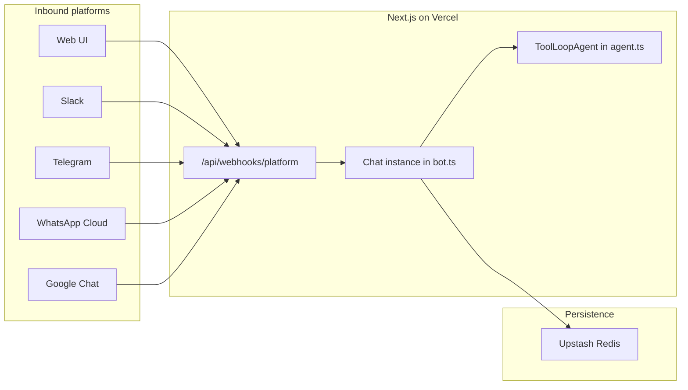

# Multi-Platform Adapter Plan

## Current state

The bot is already structured correctly for multi-platform expansion:

- [`src/lib/bot.ts`](src/lib/bot.ts) — single `Chat` instance with platform-agnostic handlers (`onNewMention`, `onSubscribedMessage`, `onDirectMessage`) and shared AI streaming via `agent.stream()`
- [`src/app/api/webhooks/[platform]/route.ts`](src/app/api/webhooks/[platform]/route.ts) — dynamic webhook router already supports GET + POST (required for WhatsApp/Meta verification)
- [`src/lib/agent.ts`](src/lib/agent.ts) — `ToolLoopAgent` logic is reusable across all adapters without changes

Today only **Web** (`@chat-adapter/web`) and **in-memory state** (`@chat-adapter/state-memory`) are wired. Production multi-instance deploys need Redis before going live.



## Target adapters (Phase 1)

| Platform | Package | Webhook path | Primary trigger for this bot |
|---|---|---|---|
| Slack | `@chat-adapter/slack` | `/api/webhooks/slack` | `onNewMention` + `onSubscribedMessage` |
| Telegram | `@chat-adapter/telegram` | `/api/webhooks/telegram` | `onDirectMessage` (DMs) + `onNewMention` (groups) |
| WhatsApp | `@chat-adapter/whatsapp` | `/api/webhooks/whatsapp` | `onDirectMessage` (1:1 business chats) |
| Google Chat | `@chat-adapter/gchat` | `/api/webhooks/gchat` | `onNewMention`; optional Pub/Sub for space messages |
| Web (keep) | `@chat-adapter/web` | `/api/webhooks/web` + `/api/chat` | existing browser chat |

**State:** replace memory with `@chat-adapter/state-redis` using your Upstash `REDIS_URL`.

**Phase 2 (you selected "Other"):** defer until you specify — common options are iMessage (`chat-adapter-sendblue`, `@linqapp/chat-sdk-adapter`, `@photon-ai/chat-adapter-imessage`), Novu multi-channel (`@novu/chat-sdk-adapter`), or SMS (`@chat-adapter/twilio`). Same handler pattern applies.

---

## Implementation steps

### 1. Install adapter packages

Add to [`package.json`](package.json):

```bash
npm i @chat-adapter/slack @chat-adapter/telegram @chat-adapter/whatsapp @chat-adapter/gchat @chat-adapter/state-redis
```

Keep existing `chat`, `@chat-adapter/web`, and `@chat-adapter/state-memory` (memory can remain as a local-dev fallback).

### 2. Register adapters in `bot.ts`

Refactor [`src/lib/bot.ts`](src/lib/bot.ts) to:

1. **Import** `createSlackAdapter`, `createTelegramAdapter`, `createWhatsAppAdapter`, `createGoogleChatAdapter`, and `createRedisState`.
2. **Conditionally register adapters** only when required env vars are present (so local dev without Slack creds still boots). Pattern:

```typescript
const adapters: Chat["adapters"] = {
  web: createWebAdapter({ userName, getUser }),
};

if (process.env.SLACK_BOT_TOKEN) {
  adapters.slack = createSlackAdapter();
}
if (process.env.TELEGRAM_BOT_TOKEN) {
  adapters.telegram = createTelegramAdapter({ mode: "auto" });
}
if (process.env.WHATSAPP_ACCESS_TOKEN) {
  adapters.whatsapp = createWhatsAppAdapter();
}
if (process.env.GOOGLE_CHAT_CREDENTIALS || process.env.GOOGLE_CHAT_USE_ADC) {
  adapters.gchat = createGoogleChatAdapter();
}
```

3. **Swap state adapter:**

```typescript
state: process.env.REDIS_URL
  ? createRedisState({ url: process.env.REDIS_URL })
  : createMemoryState(),
```

4. **Add production hardening options** recommended by Chat SDK docs:
   - `dedupeTtlMs: 600_000` — webhook deduplication across serverless instances
   - `overlappingMessages: "queue"` (or `"debounce"`) — prevents concurrent AI streams when users send rapid follow-ups on the same thread

5. **Call `bot.initialize()`** for Telegram auto-mode (webhook in prod, polling locally). Export an async init helper and invoke it from the webhook route before handling Telegram events, per Chat SDK guidance.

Existing handlers (`respondWithAgent`) stay unchanged — Chat SDK normalizes threads/messages across platforms.

### 3. Update Next.js config

Extend [`next.config.ts`](next.config.ts) `transpilePackages` with the new adapter packages so Next 16 compiles them correctly:

```typescript
transpilePackages: [
  "chat",
  "@chat-adapter/web",
  "@chat-adapter/slack",
  "@chat-adapter/telegram",
  "@chat-adapter/whatsapp",
  "@chat-adapter/gchat",
  "@chat-adapter/state-redis",
  "@chat-adapter/state-memory",
],
```

If build errors mention native/server-only deps, add `serverExternalPackages` entries as needed (unlikely for these official adapters).

### 4. Document environment variables

Expand [`.env.example`](.env.example) using the Chat SDK adapter catalog (`chat/adapters` + per-package READMEs). Minimum vars per platform:

**Shared / AI (already present)**
- `BOT_USERNAME`, `AI_GATEWAY_API_KEY`, optional `AI_MODEL`

**Redis (Upstash)**
- `REDIS_URL` — Upstash connection string (`rediss://...`)

**Slack**
- `SLACK_BOT_TOKEN` — `xoxb-...`
- `SLACK_SIGNING_SECRET`

**Telegram**
- `TELEGRAM_BOT_TOKEN`
- `TELEGRAM_WEBHOOK_SECRET_TOKEN`
- `TELEGRAM_BOT_USERNAME`

**WhatsApp Business Cloud**
- `WHATSAPP_ACCESS_TOKEN`
- `WHATSAPP_APP_SECRET`
- `WHATSAPP_PHONE_NUMBER_ID`
- `WHATSAPP_VERIFY_TOKEN` — must match Meta dashboard

**Google Chat** (most setup-heavy)
- `GOOGLE_CHAT_CREDENTIALS` — service account JSON (single-line)
- `GOOGLE_CHAT_PROJECT_NUMBER` — webhook JWT verification
- Optional for receiving all space messages (not just @mentions):
  - `GOOGLE_CHAT_PUBSUB_TOPIC`
  - `GOOGLE_CHAT_IMPERSONATE_USER` — domain-wide delegation admin
  - `GOOGLE_CHAT_PUBSUB_AUDIENCE` — your public webhook URL

### 5. Platform app configuration (external setup)

Each messenger needs its developer console pointed at your deployed webhook. After Vercel deploy (or ngrok for local dev):

| Platform | Callback URL | Notes |
|---|---|---|
| Slack | `https://<domain>/api/webhooks/slack` | Enable Events API: `app_mention`, `message.im`, `message.channels` (as needed) |
| Telegram | `https://<domain>/api/webhooks/telegram` | Register via `setWebhook` with matching `secret_token` |
| WhatsApp | `https://<domain>/api/webhooks/whatsapp` | Meta verifies via GET; subscribe to `messages` field |
| Google Chat | `https://<domain>/api/webhooks/gchat` | GCP project + Chat API app; Pub/Sub push if using Workspace Events |

Reference guides in Chat SDK:
- [Slack + Redis guide](https://chat-sdk.dev) (`how-to-build-a-slack-bot-with-next-js-and-redis`)
- [Telegram adapter docs](https://chat-sdk.dev/adapters) — webhook secret + `setWebhook`
- [WhatsApp adapter docs](https://chat-sdk.dev/adapters) — Meta handshake + signature verification
- [Google Chat adapter docs](https://chat-sdk.dev/adapters) — service account + optional Pub/Sub

### 6. Update README

Update [`README.md`](README.md) with:

- New webhook endpoints table
- Per-platform setup checklist (env vars + console steps)
- Note that **Redis is required for production** (subscriptions/locks don't survive serverless cold starts with memory state)
- Local dev guidance: Telegram falls back to polling when webhook isn't configured; other platforms need a tunnel (ngrok, Cloudflare Tunnel, Vercel preview)

### 7. Verify behavior per platform

Manual test matrix after wiring:

1. **Slack** — @mention bot in channel → bot subscribes → follow-up messages get AI replies (streamed)
2. **Telegram** — DM bot → `onDirectMessage` fires → streamed reply
3. **WhatsApp** — send message to business number → `onDirectMessage` → reply
4. **Google Chat** — @mention in space → subscribe + reply; if Pub/Sub enabled, test non-mention space messages
5. **Web** — existing `/api/chat` flow still works
6. **Redis** — restart/redeploy → subscribed threads still receive follow-ups (proves state persistence)

Run `npm run typecheck` and `npm run build` to catch missing transpile/env typing issues.

---

## Architecture decisions

**Why conditional adapter registration?** Avoids hard-failing startup when only some platform creds are configured during incremental rollout.

**Why Redis before multi-platform prod?** `onSubscribedMessage` depends on persisted thread subscriptions and distributed locks. In-memory state breaks across Vercel instances and cold starts.

**Why keep handlers unchanged?** Chat SDK's core value is write-once handlers. Platform differences (WhatsApp templates, Telegram keyboards, Google Chat cards) only matter when you add rich interactivity later.

**Optional near-term enhancements (not blocking Phase 1):**
- Platform-aware system prompt tweaks (e.g., shorter replies for WhatsApp)
- `chat/ai` built-in workspace tools for cross-posting
- Vercel Connect for Slack/GitHub token management instead of long-lived `SLACK_BOT_TOKEN`

---

## Risk / complexity notes

- **Google Chat** is the highest-effort integration (GCP service account, domain-wide delegation, optional Pub/Sub). Plan to implement Slack + Telegram + WhatsApp first, then Google Chat.
- **WhatsApp** requires Meta Business verification and approved phone number before real traffic.
- **Telegram groups** may need explicit mention handling; DMs are the simplest first test.
- **"Other" vendor adapters** each have their own npm package and webhook shape — add as separate small PRs once you name the target channel(s).
