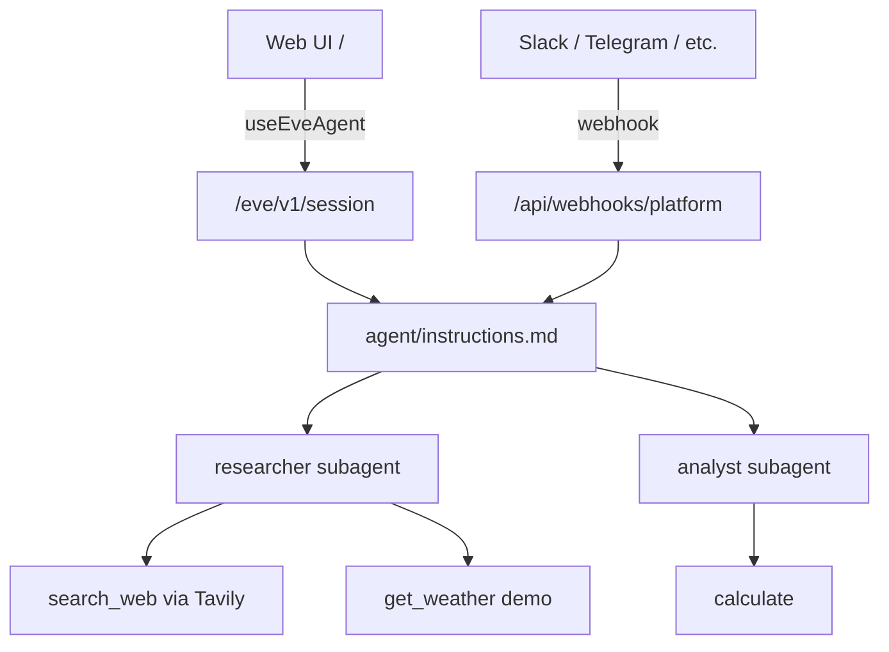

# basic-ai-agent

A multi-platform multi-agent assistant built with [eve](https://eve.dev), [Chat SDK](https://chat-sdk.dev), and a polished web UI powered by [Vercel AI Elements](https://elements.ai-sdk.dev).

## Prerequisites

- **Node 24+** (see `engines` in `package.json`)
- **[Vercel AI Gateway](https://vercel.com/docs/ai-gateway) API key** — set `AI_GATEWAY_API_KEY` in `.env.local`
- **Optional:** `TAVILY_API_KEY` for real web search via the researcher subagent
- **Optional:** `REDIS_URL` for production Chat SDK thread subscriptions (Upstash Redis recommended)

## Quick start (web chat)

1. Copy the example environment file and add your AI Gateway key:

```bash
cp .env.example .env.local
```

2. Install dependencies and start the dev server:

```bash
npm install
npm run dev
```

`npm install` uses `legacy-peer-deps=true` from [`.npmrc`](.npmrc).

3. Open [http://localhost:3000](http://localhost:3000).

[`withEve()`](next.config.ts) in `next.config.ts` runs the Next.js app and eve agent runtime together. The browser calls eve same-origin via `useEveAgent` — no separate agent URL is needed. In local dev, [`getEveDevHost()`](src/lib/eve-host.ts) resolves the eve dev server origin when rewrites lag.

### Platform webhooks

To connect Slack, Telegram, WhatsApp, Google Chat, or GitHub, expose your server to the internet (ngrok, Cloudflare Tunnel, or a Vercel preview) and configure webhook URLs in each platform's developer console. See [Platform Setup](#platform-setup) below.

Adapters are registered conditionally — only platforms with credentials in `.env.local` are enabled.

## Architecture

The root **orchestrator** ([`agent/instructions.md`](agent/instructions.md)) delegates focused work to specialist subagents and synthesizes a single reply. Root [`agent/tools/*`](agent/tools/) call `disableTool()` so the orchestrator does not use filesystem or shell harness tools directly.



| Subagent | Role | Tools |
| --- | --- | --- |
| `researcher` | Web search, current facts, weather | `search_web` (Tavily — requires `TAVILY_API_KEY`), `get_weather` (demo stub with random values) |
| `analyst` | Math and numeric calculations | `calculate` (safe expression evaluator in [`agent/lib/evaluate.ts`](agent/lib/evaluate.ts)) |

- **Web UI** talks to eve over the HTTP channel (`/eve/v1/session`) via `useEveAgent`.
- **Slack, Telegram, WhatsApp, Google Chat, GitHub** connect through eve's Chat SDK channel in [`agent/channels/chat-sdk.ts`](agent/channels/chat-sdk.ts) at `/api/webhooks/{platform}` — no manual Next.js webhook route file is required.
- **Durable sessions** — in production, eve uses Vercel Workflows so sessions survive cold starts and redeploys. In local dev, workflow state is stored under `.workflow-data/` (gitignored).
- **Redis** persists Chat SDK thread subscriptions across serverless instances in production. Without a real `REDIS_URL`, the bot falls back to in-memory state (development only).
- **Browser auth** — [`agent/channels/eve.ts`](agent/channels/eve.ts) uses `localDev()` and `none()` so local dev is open until real auth is wired ([`src/lib/auth-stub.ts`](src/lib/auth-stub.ts) is a placeholder).

## Web UI

The browser chat at `/` uses [AI Elements](https://elements.ai-sdk.dev/components) and shadcn/ui:

- **Empty state** — multi-agent roster ([`agent-roster.tsx`](src/components/chat/agent-roster.tsx)) with example prompts
- **During chat** — streaming markdown and tool-call cards via [`message-parts.tsx`](src/components/chat/message-parts.tsx)
- **Delegation UI** — specialist activity badges (`researcher`, `analyst`) from the eve event stream ([`subagent-activity.tsx`](src/components/chat/subagent-activity.tsx))
- **Composer** — model picker (models from [`chat-config.ts`](src/lib/chat-config.ts)), web-search toggle, and file attachments; attaching files auto-switches to a vision-capable model when needed ([`prompt-area.tsx`](src/components/chat/prompt-area.tsx))
- **Theme** — system-aware light/dark toggle ([`theme-toggle.tsx`](src/components/chat/theme-toggle.tsx))
- **Per-turn options** — `{ model, webSearch }` sent as ephemeral `clientContext` on each message; drives orchestrator model selection and researcher delegation preference

The shell is wired in [`eve-chat-shell.tsx`](src/components/chat/eve-chat-shell.tsx) and [`eve-message-list.tsx`](src/components/chat/eve-message-list.tsx).

## Environment variables

| Variable | Required | Purpose |
| --- | --- | --- |
| `AI_GATEWAY_API_KEY` | Yes | LLM calls via [Vercel AI Gateway](https://vercel.com/docs/ai-gateway) |
| `AI_MODEL` | No | Default model override (fallback: `anthropic/claude-sonnet-4`) |
| `TAVILY_API_KEY` | No | Enables researcher `search_web` tool via Tavily |
| `REDIS_URL` | Production | Chat SDK subscriptions and distributed locks; dev falls back to in-memory state |
| `BOT_USERNAME` | No | Chat SDK bot display name (default: `basic-ai-agent`) |
| Platform vars | Per adapter | Enable Slack, Telegram, WhatsApp, Google Chat, or GitHub conditionally |

See [`.env.example`](.env.example) for the full list. The placeholder `REDIS_URL` in `.env.example` is ignored intentionally — [`agent/channels/chat-sdk.ts`](agent/channels/chat-sdk.ts) detects example values and falls back to in-memory state.

## Endpoints

| Surface | URL |
| --- | --- |
| Web chat UI | `/` |
| eve HTTP API | `/eve/v1/session` |
| Slack webhook | `/api/webhooks/slack` |
| Telegram webhook | `/api/webhooks/telegram` |
| WhatsApp webhook | `/api/webhooks/whatsapp` |
| Google Chat webhook | `/api/webhooks/gchat` |
| GitHub webhook | `/api/webhooks/github` |

Replace `https://your-domain.com` with your deployed URL or tunnel address. eve also serves internal workflow routes in production — no manual setup required.

## Platform Setup

### Redis (production)

Set `REDIS_URL` to your [Upstash Redis](https://upstash.com) connection string. Redis is required in production so thread subscriptions and distributed locks survive serverless cold starts and multi-instance deploys. Without a real connection string, the bot falls back to in-memory state (development only).

### Slack

1. Create a Slack app at [api.slack.com/apps](https://api.slack.com/apps).
2. Enable **Event Subscriptions** with request URL `https://your-domain.com/api/webhooks/slack`.
3. Subscribe to bot events: `app_mention`, and optionally `message.im` / `message.channels`.
4. Install the app to your workspace and copy the **Bot User OAuth Token** and **Signing Secret**.
5. Set `SLACK_BOT_TOKEN` and `SLACK_SIGNING_SECRET` in `.env.local`.

### Telegram

1. Create a bot via [@BotFather](https://t.me/BotFather) and copy the token.
2. Set `TELEGRAM_BOT_TOKEN`, `TELEGRAM_WEBHOOK_SECRET_TOKEN`, and `TELEGRAM_BOT_USERNAME`.
3. Register the webhook:

```bash
curl -X POST "https://api.telegram.org/bot$TELEGRAM_BOT_TOKEN/setWebhook" \
  -H "Content-Type: application/json" \
  -d '{"url": "https://your-domain.com/api/webhooks/telegram", "secret_token": "your-webhook-secret"}'
```

In local dev, the adapter uses polling automatically when no webhook is configured.

### WhatsApp Business Cloud

1. Create a Meta app at [developers.facebook.com/apps](https://developers.facebook.com/apps) and add the **WhatsApp** product.
2. Set callback URL to `https://your-domain.com/api/webhooks/whatsapp`.
3. Set a verify token and subscribe to the `messages` field.
4. Copy **App Secret**, **Access Token**, and **Phone Number ID** from the Meta dashboard.
5. Set `WHATSAPP_ACCESS_TOKEN`, `WHATSAPP_APP_SECRET`, `WHATSAPP_PHONE_NUMBER_ID`, and `WHATSAPP_VERIFY_TOKEN`.

### Google Chat

1. Create a GCP project and enable the Google Chat API, Google Workspace Events API, and Cloud Pub/Sub API.
2. Create a service account, download the JSON key, and configure a Google Chat app with App URL `https://your-domain.com/api/webhooks/gchat`.
3. Set `GOOGLE_CHAT_CREDENTIALS` (single-line JSON) and `GOOGLE_CHAT_PROJECT_NUMBER`.
4. Optional: configure Pub/Sub for all space messages — set `GOOGLE_CHAT_PUBSUB_TOPIC`, `GOOGLE_CHAT_IMPERSONATE_USER`, and `GOOGLE_CHAT_PUBSUB_AUDIENCE`.

See the [Google Chat adapter docs](https://chat-sdk.dev/adapters/official/gchat) for domain-wide delegation and Pub/Sub setup.

### GitHub

The bot responds to `@mentions` in issue and pull request comment threads.

**Option A — Personal Access Token** (quickest for your own repos):

1. Create a token at [github.com/settings/tokens](https://github.com/settings/tokens) with `repo` scope.
2. Add a repository webhook:
   - **Payload URL:** `https://your-domain.com/api/webhooks/github`
   - **Content type:** `application/json`
   - **Secret:** match `GITHUB_WEBHOOK_SECRET`
   - **Events:** Issue comments, Pull request review comments
3. Set `GITHUB_TOKEN`, `GITHUB_WEBHOOK_SECRET`, and `GITHUB_BOT_USERNAME` in `.env.local`.

**Option B — GitHub App** (recommended for production):

1. Create an app at [github.com/settings/apps/new](https://github.com/settings/apps/new).
2. Set **Webhook URL** to `https://your-domain.com/api/webhooks/github` and generate a **Webhook secret**.
3. Set permissions: Issues (Read & write), Pull requests (Read & write), Metadata (Read-only).
4. Subscribe to events: **Issue comment**, **Pull request review comment**.
5. Create the app, generate a **private key**, then **Install App** on your account/repos.
6. Set `GITHUB_APP_ID`, `GITHUB_PRIVATE_KEY`, `GITHUB_WEBHOOK_SECRET`, `GITHUB_BOT_USERNAME` (e.g. `my-app[bot]`), and `GITHUB_INSTALLATION_ID` (from the install URL) in `.env.local`.

Test by @mentioning your bot on a PR or issue comment.

## Project Structure

```
agent/                          # eve agent (source of truth)
  agent.ts                      # Dynamic model from UI clientContext
  instructions.md               # Orchestrator system prompt
  lib/                          # Shared helpers (Tavily, math, UI context)
  tools/                        # disableTool() overrides at root
  subagents/
    researcher/                 # Web search and weather specialist
    analyst/                    # Math specialist
  channels/
    chat-sdk.ts                 # Platform webhooks + Redis/memory state
    eve.ts                      # Browser HTTP channel auth
src/
  app/page.tsx                  # Web chat page
  components/
    ai-elements/                # Vercel AI Elements
    chat/
      eve-chat-shell.tsx        # useEveAgent shell
      eve-message-list.tsx      # Roster, subagent activity, messages
      prompt-area.tsx           # Model picker, search toggle, attachments
    ui/                         # shadcn/ui primitives
  lib/
    chat-config.ts              # Model list and defaults
    eve-host.ts                 # Local eve dev host resolver
next.config.ts                  # withEve()
.npmrc                          # legacy-peer-deps=true
.env.example                    # Required environment variables
```

## Scripts

| Command | Description |
| --- | --- |
| `npm run dev` | Start Next.js + eve dev servers (via `withEve`) |
| `npm run build` | Create a production build (Next.js + eve) |
| `npm run start` | Start the production server |
| `npm run typecheck` | Type-check the project |

## Learn More

- [eve Documentation](https://eve.dev/docs) — also available locally in `node_modules/eve/docs/`
- [Chat SDK Documentation](https://chat-sdk.dev/docs)
- [AI Elements Documentation](https://elements.ai-sdk.dev/docs)
- [Adapter Setup Guides](https://chat-sdk.dev/adapters)
