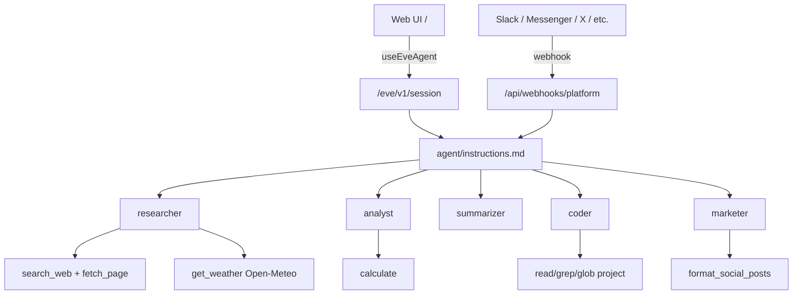
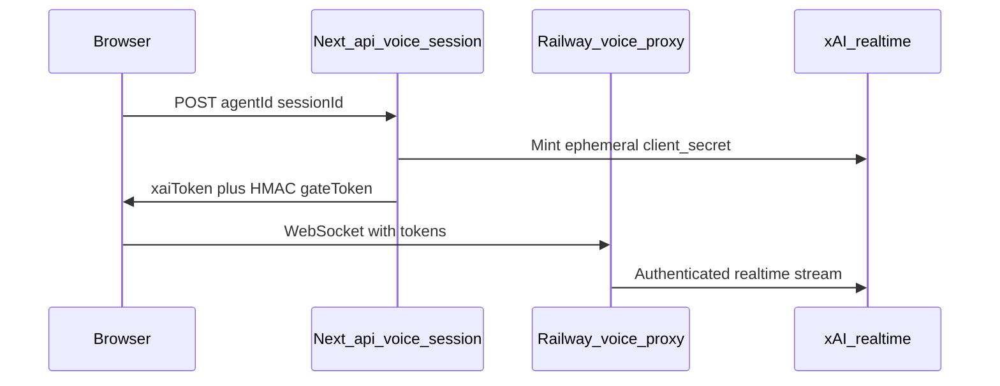

# basic-ai-agent

A multi-platform multi-agent assistant built with [eve](https://eve.dev), [Chat SDK](https://chat-sdk.dev), and a polished web UI powered by [Vercel AI Elements](https://elements.ai-sdk.dev).

## Prerequisites

- **Node 24+** (see `engines` in `package.json`)
- **[Vercel AI Gateway](https://vercel.com/docs/ai-gateway) API key** — set `AI_GATEWAY_API_KEY` in `.env.local`
- **Optional:** `TAVILY_API_KEY` for real web search via the researcher subagent
- **Optional:** `REDIS_URL` for production Chat SDK thread subscriptions (Upstash Redis recommended)
- **Optional (voice mode):** `XAI_API_KEY` for Grok Voice realtime sessions and SpeechInput STT fallback
- **Optional (voice mode):** Railway-deployed proxy from [`services/voice-proxy/`](services/voice-proxy/) — deploy as a **new** Railway service; never modify the fieldflow service at `voice.tradecraft.nexus`
- **Optional (voice mode):** `NEXT_PUBLIC_VOICE_PROXY_URL` and `VOICE_PROXY_SHARED_SECRET` on Vercel/local (must match Railway)

## Quick start (web chat)

1. Copy the example environment file and add your AI Gateway key:

```bash
cp .env.example .env.local
```

2. Install dependencies and start the dev server:

```bash
npm install
npm run dev
```

`npm install` uses `legacy-peer-deps=true` from [`.npmrc`](.npmrc).

3. Open [http://localhost:3000](http://localhost:3000).

Voice mode is optional — configure env vars and deploy the Railway proxy per [Voice mode](#voice-mode) before using the header toggle.

[`withEve()`](next.config.ts) in `next.config.ts` runs the Next.js app and eve agent runtime together. The browser calls eve same-origin via `useEveAgent` — no separate agent URL is needed. In local dev, [`getEveDevHost()`](src/lib/eve-host.ts) resolves the eve dev server origin when rewrites lag.

### Platform webhooks

To connect Slack, Telegram, WhatsApp, Messenger, X, Google Chat, GitHub, Sendblue, Discord, Teams, Linear, or Resend email, expose your server to the internet (ngrok, Cloudflare Tunnel, or a Vercel preview) and configure webhook URLs in each platform's developer console. See [Platform Setup](#platform-setup) below.

Adapters are registered conditionally — only platforms with credentials in `.env.local` are enabled. Open [`/settings`](http://localhost:3000/settings) for the full settings sidebar — Runtime tabs (Connectors, Agents & Tools) show live status; Behavior tabs (Souls, Skills, Knowledge, Voice) are preview-only scaffolds. See [Settings](#settings).

## Architecture

The root **orchestrator** ([`agent/instructions.md`](agent/instructions.md)) delegates focused work to specialist subagents and synthesizes a single reply. Root [`agent/tools/*`](agent/tools/) call `disableTool()` so the orchestrator does not use filesystem or shell tools directly.



| Subagent | Role | Tools |
| --- | --- | --- |
| `researcher` | Web search, URLs, weather | `search_web` (Tavily), `fetch_page`, `get_weather` (Open-Meteo) |
| `analyst` | Math and numeric calculations | `calculate` |
| `summarizer` | TL;DR and condensation | `fetch_page` |
| `coder` | Repo inspection and code help | `read_project_file`, `grep_project`, `glob_project`, `run_typecheck` |
| `marketer` | Copy and campaign messaging | `search_web`, `fetch_page`, `format_social_posts`, skill `copy-frameworks` |

- **Web UI** talks to eve over the HTTP channel (`/eve/v1/session`) via `useEveAgent`.
- **Slack, Telegram, WhatsApp, Messenger, X, Google Chat, GitHub, Sendblue, Discord, Teams, Linear, Resend** connect through eve's Chat SDK channel in [`agent/channels/chat-sdk.ts`](agent/channels/chat-sdk.ts) at `/api/webhooks/{platform}` — no manual Next.js webhook route file is required.
- **Connector dashboard** — [`/settings`](src/app/settings/page.tsx) shows configured adapters, live Upstash Redis status, and missing env var names (no secrets stored in the UI).
- **Agents & Tools dashboard** — [`/settings/agents`](src/app/settings/agents/page.tsx) shows eve runtime health, resolved model, subagent tool readiness, and capability deps (e.g. Tavily for `search_web`).
- **Live status API** — [`GET /api/status`](src/app/api/status/route.ts) with optional `?sections=system,agents,connectors` powers auto-refreshing status across settings and the main chat header.
- **Durable sessions** — in production, eve uses Vercel Workflows so sessions survive cold starts and redeploys. In local dev, workflow state is stored under `.workflow-data/` (gitignored).
- **Redis** persists Chat SDK thread subscriptions across serverless instances in production. Without a real `REDIS_URL`, the bot falls back to in-memory state (development only).
- **Browser auth** — [`agent/channels/eve.ts`](agent/channels/eve.ts) uses `localDev()` and `none()` so local dev is open until real auth is wired ([`src/lib/auth-stub.ts`](src/lib/auth-stub.ts) is a placeholder).

## Settings

The settings shell at [`/settings`](src/app/settings/layout.tsx) groups routes into **Runtime** (live probes) and **Behavior** (preview scaffolds):

| Route | Group | What it shows |
| --- | --- | --- |
| [`/settings`](src/app/settings/page.tsx) | Runtime | Connector status, Redis probe, missing env var names |
| [`/settings/agents`](src/app/settings/agents/page.tsx) | Runtime | eve health, subagent tool readiness |
| [`/settings/souls`](src/app/settings/souls/page.tsx) | Behavior | Soul profiles (instructions / tone) — **preview only** |
| [`/settings/skills`](src/app/settings/skills/page.tsx) | Behavior | `load_skill` markdown scoped per agent — **preview only** |
| [`/settings/knowledge`](src/app/settings/knowledge/page.tsx) | Behavior | xAI Collections mock — **preview only** |
| [`/settings/voice`](src/app/settings/voice/page.tsx) | Behavior | Grok Voice persona / voice / speed — **preview only** |

**Runtime** tabs poll [`GET /api/status`](src/app/api/status/route.ts) with optional `?sections=system,agents,connectors`. **Behavior** tabs use client-side mock state via `SettingsDraftProvider` — sticky save bar and Sonner toasts; changes are not persisted to eve, xAI, or Railway until phase 2. Field → runtime mappings live in [`settings-runtime-contract.ts`](src/lib/settings-runtime-contract.ts); mock defaults in [`settings-mock/`](src/lib/settings-mock/).

## Web UI

The browser chat at `/` uses [AI Elements](https://elements.ai-sdk.dev/components) and shadcn/ui:

- **Empty state** — multi-agent roster ([`agent-roster.tsx`](src/components/chat/agent-roster.tsx)) with per-agent Ready/Limited badges and example prompts
- **Header** — system health badge (env-aware) separate from session status (`Session: Ready` / `Streaming`)
- **During chat** — streaming markdown and tool-call cards via [`message-parts.tsx`](src/components/chat/message-parts.tsx)
- **Delegation UI** — specialist activity badges from the eve event stream ([`subagent-activity.tsx`](src/components/chat/subagent-activity.tsx))
- **Composer** — model picker (models from [`chat-config.ts`](src/lib/chat-config.ts)), web-search toggle, and file attachments; attaching files auto-switches to a vision-capable model when needed ([`prompt-area.tsx`](src/components/chat/prompt-area.tsx))
- **Theme** — system-aware light/dark toggle ([`theme-toggle.tsx`](src/components/chat/theme-toggle.tsx))
- **Per-turn options** — `{ model, webSearch }` sent as ephemeral `clientContext` on each message; drives orchestrator model selection and researcher delegation preference
- **Voice / text toggle** — header switch in [`chat-header.tsx`](src/components/chat/chat-header.tsx)
- **Voice panel** — AI Elements `Persona`, `MicSelector`, and live transcripts in [`voice-mode-panel.tsx`](src/components/chat/voice-mode-panel.tsx)
- **Collapsed composer** — voice mode hides the text input by default; optional text fallback in [`prompt-area.tsx`](src/components/chat/prompt-area.tsx)
- **SpeechInput** — browser STT where supported; MediaRecorder audio posts to [`/api/transcribe`](src/app/api/transcribe/route.ts) on Firefox/Safari
- **Grok Voice sessions** — [`use-grok-voice.ts`](src/hooks/use-grok-voice.ts) connects via Railway proxy when `NEXT_PUBLIC_VOICE_PROXY_URL` is set

The shell is wired in [`eve-chat-shell.tsx`](src/components/chat/eve-chat-shell.tsx) and [`eve-message-list.tsx`](src/components/chat/eve-message-list.tsx).

## Voice mode

Grok Voice realtime sessions use a Railway WebSocket proxy — the browser never holds your xAI API key directly.



### Deploy the voice proxy

1. Create a **new** Railway service from [`services/voice-proxy/`](services/voice-proxy/) ([`railway.toml`](services/voice-proxy/railway.toml) — Railpack build, `/health` check). Never reuse or modify the fieldflow service at `voice.tradecraft.nexus`.
2. Set Railway variables: `XAI_API_KEY`, `VOICE_PROXY_SHARED_SECRET`, `ALLOWED_ORIGINS` (your Vercel app + `http://localhost:3000`), optional `XAI_REALTIME_MODEL`, optional Upstash `KV_REST_API_URL` / `KV_REST_API_TOKEN` for connection limits.
3. Set Vercel/local variables: `XAI_API_KEY`, `NEXT_PUBLIC_VOICE_PROXY_URL`, `VOICE_PROXY_SHARED_SECRET` (must match Railway).
4. Open the chat UI → header **Voice mode** → **Connect**. The settings preview at `/settings/voice` does not affect live sessions until phase 2.

`services/voice-proxy/dist/` is gitignored — Railway builds from `src/`.

## Environment variables

| Variable | Required | Purpose |
| --- | --- | --- |
| `AI_GATEWAY_API_KEY` | Yes | LLM calls via [Vercel AI Gateway](https://vercel.com/docs/ai-gateway) |
| `AI_MODEL` | No | Default model override (fallback: `anthropic/claude-sonnet-4`) |
| `TAVILY_API_KEY` | No | Enables researcher `search_web` tool via Tavily |
| `REDIS_URL` | Production | Chat SDK subscriptions and distributed locks; dev falls back to in-memory state |
| `BOT_USERNAME` | No | Chat SDK bot display name (default: `basic-ai-agent`) |
| `XAI_API_KEY` | Voice only | xAI realtime tokens + `/api/transcribe` STT |
| `NEXT_PUBLIC_VOICE_PROXY_URL` | Voice only | Public Railway proxy URL (client WebSocket) |
| `VOICE_PROXY_SHARED_SECRET` | Voice only | HMAC gate between Next.js and proxy |
| `ALLOWED_ORIGINS` | Railway proxy | CORS allowlist (Vercel app + `http://localhost:3000`) |
| `XAI_REALTIME_MODEL` | No | Default `grok-voice-think-fast-1.0` on proxy |
| Platform vars | Per adapter | Enable Slack, Telegram, WhatsApp, Messenger, X, Google Chat, GitHub, Sendblue, Discord, Teams, Linear, or Resend conditionally |

See [`.env.example`](.env.example) for the full list. The placeholder `REDIS_URL` in `.env.example` is ignored intentionally — [`agent/channels/chat-sdk.ts`](agent/channels/chat-sdk.ts) detects example values and falls back to in-memory state.

## Endpoints

| Surface | URL |
| --- | --- |
| Web chat UI | `/` |
| Connector settings | `/settings` |
| Agents & Tools settings | `/settings/agents` |
| Souls settings | `/settings/souls` |
| Skills settings | `/settings/skills` |
| Knowledge settings | `/settings/knowledge` |
| Voice settings | `/settings/voice` |
| Status API | `/api/status?sections=system,agents,connectors` |
| Voice session mint | `POST /api/voice/session` |
| Speech STT fallback | `POST /api/transcribe` |
| eve HTTP API | `/eve/v1/session` |
| Slack webhook | `/api/webhooks/slack` |
| Telegram webhook | `/api/webhooks/telegram` |
| WhatsApp webhook | `/api/webhooks/whatsapp` |
| Messenger webhook | `/api/webhooks/messenger` |
| X webhook | `/api/webhooks/x` |
| Google Chat webhook | `/api/webhooks/gchat` |
| GitHub webhook | `/api/webhooks/github` |
| Sendblue webhook | `/api/webhooks/sendblue` |
| Discord webhook | `/api/webhooks/discord` |
| Teams webhook | `/api/webhooks/teams` |
| Linear webhook | `/api/webhooks/linear` |
| Resend webhook | `/api/webhooks/resend` |

Replace `https://your-domain.com` with your deployed URL or tunnel address. eve also serves internal workflow routes in production — no manual setup required.

## Platform Setup

### Redis (production)

Set `REDIS_URL` to your [Upstash Redis](https://upstash.com) connection string. Redis is required in production so thread subscriptions and distributed locks survive serverless cold starts and multi-instance deploys. Without a real connection string, the bot falls back to in-memory state (development only).

### Slack

1. Create a Slack app at [api.slack.com/apps](https://api.slack.com/apps).
2. Enable **Event Subscriptions** with request URL `https://your-domain.com/api/webhooks/slack`.
3. Subscribe to bot events: `app_mention`, and optionally `message.im` / `message.channels`.
4. Install the app to your workspace and copy the **Bot User OAuth Token** and **Signing Secret**.
5. Set `SLACK_BOT_TOKEN` and `SLACK_SIGNING_SECRET` in `.env.local`.

### Telegram

1. Create a bot via [@BotFather](https://t.me/BotFather) and copy the token.
2. Set `TELEGRAM_BOT_TOKEN`, `TELEGRAM_WEBHOOK_SECRET_TOKEN`, and `TELEGRAM_BOT_USERNAME`.
3. Register the webhook:

```bash
curl -X POST "https://api.telegram.org/bot$TELEGRAM_BOT_TOKEN/setWebhook" \
  -H "Content-Type: application/json" \
  -d '{"url": "https://your-domain.com/api/webhooks/telegram", "secret_token": "your-webhook-secret"}'
```

In local dev, the adapter uses polling automatically when no webhook is configured.

### WhatsApp Business Cloud

1. Create a Meta app at [developers.facebook.com/apps](https://developers.facebook.com/apps) and add the **WhatsApp** product.
2. Set callback URL to `https://your-domain.com/api/webhooks/whatsapp`.
3. Set a verify token and subscribe to the `messages` field.
4. Copy **App Secret**, **Access Token**, and **Phone Number ID** from the Meta dashboard.
5. Set `WHATSAPP_ACCESS_TOKEN`, `WHATSAPP_APP_SECRET`, `WHATSAPP_PHONE_NUMBER_ID`, and `WHATSAPP_VERIFY_TOKEN`.

### Facebook Messenger

1. Create a Meta app at [developers.facebook.com/apps](https://developers.facebook.com/apps) and add **Messenger**.
2. Under **Messenger → Settings**, set callback URL to `https://your-domain.com/api/webhooks/messenger` and choose a verify token (`FACEBOOK_VERIFY_TOKEN`).
3. Subscribe to: `messages`, `messaging_postbacks`, `messaging_reactions`, `message_deliveries`, `message_reads`.
4. Generate a **Page Access Token** for your Facebook Page.
5. Set `FACEBOOK_APP_SECRET`, `FACEBOOK_PAGE_ACCESS_TOKEN`, and `FACEBOOK_VERIFY_TOKEN` in `.env.local`.

See the [Messenger adapter docs](https://chat-sdk.dev/adapters/official/messenger).

### X (Twitter)

1. Create a Project and App in the [X developer portal](https://developer.x.com).
2. Copy the **API Key Secret** to `X_CONSUMER_SECRET`.
3. Enable OAuth 2.0 user authentication with scopes: `tweet.read`, `tweet.write`, `users.read`, `dm.read`, `dm.write`, `like.write`, and `offline.access`.
4. In the [X developer console](https://console.x.com), register webhook `https://your-domain.com/api/webhooks/x` (HTTPS, no port) and subscribe to `post.mention.create`, `dm.received`, and `dm.sent`.
5. Set credentials in `.env.local`:
   - **Option A:** `X_USER_ACCESS_TOKEN` (static, ~2h expiry)
   - **Option B (production):** `X_CLIENT_ID` + `X_REFRESH_TOKEN` with `REDIS_URL` for token persistence

**Automation policy:** Disclose bot identity, honor opt-outs, and follow [X automation rules](https://docs.x.com/developer-terms/policy).

See the [X adapter docs](https://chat-sdk.dev/adapters/official/x).

### Google Chat

1. Create a GCP project and enable the Google Chat API, Google Workspace Events API, and Cloud Pub/Sub API.
2. Create a service account, download the JSON key, and configure a Google Chat app with App URL `https://your-domain.com/api/webhooks/gchat`.
3. Set `GOOGLE_CHAT_CREDENTIALS` (single-line JSON) and `GOOGLE_CHAT_PROJECT_NUMBER`.
4. Optional: configure Pub/Sub for all space messages — set `GOOGLE_CHAT_PUBSUB_TOPIC`, `GOOGLE_CHAT_IMPERSONATE_USER`, and `GOOGLE_CHAT_PUBSUB_AUDIENCE`.

See the [Google Chat adapter docs](https://chat-sdk.dev/adapters/official/gchat) for domain-wide delegation and Pub/Sub setup.

### GitHub

The bot responds to `@mentions` in issue and pull request comment threads.

**Option A — Personal Access Token** (quickest for your own repos):

1. Create a token at [github.com/settings/tokens](https://github.com/settings/tokens) with `repo` scope.
2. Add a repository webhook:
   - **Payload URL:** `https://your-domain.com/api/webhooks/github`
   - **Content type:** `application/json`
   - **Secret:** match `GITHUB_WEBHOOK_SECRET`
   - **Events:** Issue comments, Pull request review comments
3. Set `GITHUB_TOKEN`, `GITHUB_WEBHOOK_SECRET`, and `GITHUB_BOT_USERNAME` in `.env.local`.

**Option B — GitHub App** (recommended for production):

1. Create an app at [github.com/settings/apps/new](https://github.com/settings/apps/new).
2. Set **Webhook URL** to `https://your-domain.com/api/webhooks/github` and generate a **Webhook secret**.
3. Set permissions: Issues (Read & write), Pull requests (Read & write), Metadata (Read-only).
4. Subscribe to events: **Issue comment**, **Pull request review comment**.
5. Create the app, generate a **private key**, then **Install App** on your account/repos.
6. Set `GITHUB_APP_ID`, `GITHUB_PRIVATE_KEY`, `GITHUB_WEBHOOK_SECRET`, `GITHUB_BOT_USERNAME` (e.g. `my-app[bot]`), and `GITHUB_INSTALLATION_ID` (from the install URL) in `.env.local`.

Test by @mentioning your bot on a PR or issue comment.

### Sendblue

1. Sign up at [Sendblue](https://sendblue.com) and obtain API credentials (`SENDBLUE_API_KEY`, `SENDBLUE_API_SECRET`) and a sender number (`SENDBLUE_FROM_NUMBER` in E.164 format).
2. Set the receive webhook URL to `https://your-domain.com/api/webhooks/sendblue`.
3. Optionally set `SENDBLUE_WEBHOOK_SECRET` for signature verification.
4. The adapter accepts iMessage, SMS, and RCS inbound traffic when credentials are set.

See the [Sendblue adapter docs](https://chat-sdk.dev/adapters/vendor-official/sendblue) for CLI setup (`sendblue setup`, `sendblue show-keys`, `sendblue lines`).

### Discord

1. Create an application in the [Discord Developer Portal](https://discord.com/developers/applications).
2. Copy the **Application ID** and **Public Key** from General Information.
3. Create a bot token under **Bot** and enable **Message Content Intent** if needed.
4. Set **Interactions Endpoint URL** to `https://your-domain.com/api/webhooks/discord`.
5. Set `DISCORD_BOT_TOKEN`, `DISCORD_PUBLIC_KEY`, and `DISCORD_APPLICATION_ID` in `.env.local`.

**Note:** HTTP interactions handle slash commands and @mentions on serverless. Regular channel messages require a [Gateway listener](https://chat-sdk.dev/adapters/official/discord) cron on Vercel.

### Microsoft Teams

1. Install the [Teams CLI](https://www.npmjs.com/package/@microsoft/teams.cli): `npm install -g @microsoft/teams.cli`
2. Run `teams login`, then `teams app create --name "My Bot" --endpoint "https://your-domain.com/api/webhooks/teams" --env .env`
3. Map credentials to `TEAMS_APP_ID`, `TEAMS_APP_PASSWORD`, and optionally `TEAMS_APP_TENANT_ID`.
4. Install the app in Teams via the generated install link.

See the [Teams adapter docs](https://chat-sdk.dev/adapters/official/teams) for RSC permissions and troubleshooting.

### Linear

1. Create a personal API key at **Settings → Security & Access** with comment permissions.
2. Create a webhook at **Settings → API** pointing to `https://your-domain.com/api/webhooks/linear`.
3. Copy the signing secret to `LINEAR_WEBHOOK_SECRET`.
4. Set `LINEAR_API_KEY` in `.env.local`.
5. For @-mentionable app actors, set `LINEAR_MODE=agent-sessions` and install with the `app:mentionable` scope.

See the [Linear adapter docs](https://chat-sdk.dev/adapters/official/linear) for OAuth and agent session modes.

### Resend

1. Create a [Resend](https://resend.com) account and verify your sending domain.
2. Create an API key (`RESEND_API_KEY`) and inbound webhook (`RESEND_WEBHOOK_SECRET`).
3. Set `RESEND_FROM_ADDRESS` (and optionally `RESEND_FROM_NAME`) for outbound email.
4. Point the Resend inbound webhook to `https://your-domain.com/api/webhooks/resend`.

See the [Resend adapter docs](https://chat-sdk.dev/adapters/vendor-official/resend) for threading and card email examples.

## Project Structure

```
agent/                          # eve agent (source of truth)
  agent.ts                      # Dynamic model from UI clientContext
  instructions.md               # Orchestrator system prompt
  skills/                       # eve load_skill markdown (e.g. chat-reply-format.md)
  lib/                          # Shared helpers (Tavily, fetch-page, project-files, connectors)
  tools/                        # disableTool() overrides at root
  subagents/
    researcher/                 # Web search, URLs, weather
    analyst/                    # Math specialist
    summarizer/                 # TL;DR specialist
    coder/                      # Repo inspection specialist
    marketer/                   # Marketing copy specialist
  channels/
    chat-sdk.ts                 # Platform webhooks + Redis/memory state
    eve.ts                      # Browser HTTP channel auth
services/
  voice-proxy/                  # Grok Voice WebSocket proxy (Railway)
    src/                        # server.ts, proxy-handler.ts, xai-config.ts
    railway.toml
src/
  app/
    page.tsx                    # Web chat page
    settings/                   # All six settings routes (Runtime + Behavior)
    api/
      status/                   # Unified live status API
      voice/                    # Session token mint
      transcribe/               # xAI STT fallback
      connectors/status/        # Legacy connector slice (thin re-export)
  components/
    ai-elements/                # Vercel AI Elements (installed UI components)
    chat/
      eve-chat-shell.tsx        # useEveAgent shell + voice mode
      eve-message-list.tsx      # Roster, subagent activity, messages, voice panel
      voice-mode-panel.tsx      # Persona, MicSelector, transcripts
      prompt-area.tsx           # Model picker, search toggle, attachments
    settings/                   # Settings dashboards + draft context
    ui/                         # shadcn/ui primitives
  hooks/
    use-grok-voice.ts           # Grok Voice realtime hook
  lib/
    voice/                      # persona-state, runtime, settings-resolver
    voice-client/               # GrokVoiceClient protocol
    audio/                      # Web Audio capture/playback
    settings-mock/              # Behavior tab seed data
    settings-runtime-contract.ts
    agent-meta.ts               # Shared agent labels/icons
    chat-config.ts              # Model list and defaults
    eve-host.ts                 # Local eve dev host resolver
    resolve-eve-origin.ts       # Eve origin for health probes
    status-types.ts             # Status vocabulary
next.config.ts                  # withEve()
.npmrc                          # legacy-peer-deps=true
.env.example                    # Required environment variables
```

## Scripts

| Command | Description |
| --- | --- |
| `npm run dev` | Start Next.js + eve dev servers (via `withEve`) |
| `npm run build` | Create a production build (Next.js + eve) |
| `npm run start` | Start the production server |
| `npm run typecheck` | Type-check the project |

## Learn More

- [eve Documentation](https://eve.dev/docs) — also available locally in `node_modules/eve/docs/`
- [Chat SDK Documentation](https://chat-sdk.dev/docs)
- [AI Elements Documentation](https://elements.ai-sdk.dev/docs)
- [Adapter Setup Guides](https://chat-sdk.dev/adapters)
