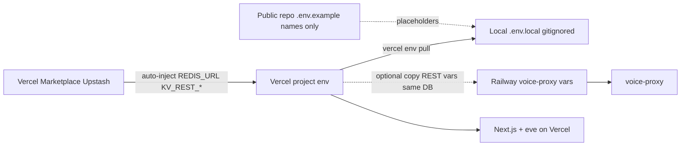

# Launch runbook (secrets-safe)

Phased checklist to bring [OpenSocket AI Agent](https://agent.opensocket.xyz) to production-healthy, then enable connectors one at a time — **without committing secrets** to this public repo.

Production URL: `https://agent.opensocket.xyz`  
Vercel project: `opensocket-ai-agent`  
Placeholder names only live in `[.env.example](../.env.example)`. Deep platform setup: [README — Platform Setup](../README.md#platform-setup).

## Secrets rules

- Never commit `.env`, `.env.local`, or real tokens. They are gitignored.
- Never paste secret values into issues, PRs, or chat that lands in the public repo.
- **Source of truth:** Vercel project env (Sensitive where supported) + Railway (voice proxy only).
- **Redis:** provision Upstash **only** via [Vercel Marketplace](https://vercel.com/marketplace/upstash) — do not create a standalone Upstash database outside Vercel for this app.
- Local sync (names + values stay on your machine):

```bash
vercel link   # once, project opensocket-ai-agent
vercel env pull .env.local
```

- Add non-Marketplace secrets:

```bash
vercel env add AI_GATEWAY_API_KEY production --sensitive
# repeat for preview if needed
```

- Audit **names** only: `vercel env ls`
- After every phase: `git status` must not show `.env*` files staged.


## Where secrets live




| Surface                      | What goes there                                                                                                                                                                                                                                                                    |
| ---------------------------- | ---------------------------------------------------------------------------------------------------------------------------------------------------------------------------------------------------------------------------------------------------------------------------------- |
| Vercel Marketplace → project | Upstash Redis: TCP `REDIS_URL` and/or `KV_URL` (Chat SDK + `/settings` probe) plus REST `KV_REST_API_URL` / `KV_REST_API_TOKEN` (or `UPSTASH_REDIS_REST_*`)                                                                                                                        |
| Vercel (manual Sensitive)    | `AI_GATEWAY_API_KEY`, `APP_URL` / `NEXT_PUBLIC_APP_URL`, optional `XAI_API_KEY` (web search + voice), platform connector vars, voice proxy: `VOICE_PROXY_SHARED_SECRET`, `NEXT_PUBLIC_VOICE_PROXY_URL`, optional `XAI_VOICE_AGENT_ID`, optional `TAVILY_API_KEY` (search fallback) |
| Railway                      | `VOICE_PROXY_SHARED_SECRET` (must match Vercel), `ALLOWED_ORIGINS`, optional REST vars from the **same** Marketplace DB, optional `XAI_VOICE_AGENT_ID` / `XAI_REALTIME_MODEL`. Proxy does **not** need `XAI_API_KEY` (tokens are minted on Vercel).                                |
| Public repo                  | `[.env.example](../.env.example)` placeholders only                                                                                                                                                                                                                                |


## Verification loop (every phase)

1. Add or link env on Vercel / Railway (Redis only via Marketplace).
2. Redeploy the affected surface.
3. `vercel env pull .env.local` for local.
4. Open `[/settings](https://agent.opensocket.xyz/settings)` — missing-env list shows **names** only.
5. Smoke-test the feature or channel.
6. Confirm `git status` has no `.env*` staged.

---


## Phase 0 — Core (required for production healthy)

Goal: web chat works; `/settings` shows system healthy (eve live + `AI_GATEWAY_API_KEY` + Redis live).

- [x] Node **24+** (`node -v`)
- [ ] `vercel link` → project `opensocket-ai-agent`
- [x] Set `AI_GATEWAY_API_KEY` (Sensitive) for Production (and Preview if you use preview deploys)
- [x] **Redis via Marketplace only**
  - [ ] `vercel integration add upstash` **or** install from [Marketplace → Upstash](https://vercel.com/marketplace/upstash)
  - [ ] Create or link a Redis database to this Vercel project
  - [ ] `vercel env ls` — confirm Redis-related names appeared
  - [ ] Chat SDK needs a real TCP `REDIS_URL` (`rediss://…`). If Marketplace injects REST/`KV_*` but not `REDIS_URL`, set `REDIS_URL` once from the **Vercel-linked** Upstash resource details in the Vercel dashboard (still Marketplace-sourced — do not open a separate Upstash signup flow)
- [ ] Set `APP_URL` and `NEXT_PUBLIC_APP_URL` to `https://agent.opensocket.xyz`
- [ ] Optional: `XAI_API_KEY` (enables researcher/marketer `search_web` via xAI; also used in Phase 1 for voice)
- [ ] Optional: `TAVILY_API_KEY` (fallback web search only when xAI is unavailable)
- [ ] Optional: `AI_MODEL`, `BOT_USERNAME`
- [ ] Redeploy Vercel
- [ ] Verify: open `/`, send a chat message
- [ ] Verify: `/settings` → Redis **live**, system **healthy**
- [ ] Verify: `GET /api/status?sections=system`

---


## Phase 1 — Voice (optional)

Grok Voice uses a **new** Railway service from `[services/voice-proxy/](../services/voice-proxy/)`. Never reuse `voice.tradecraft.nexus`. Full sequence: [README — Voice mode](../README.md#voice-mode).

### Vercel / local

- [ ] `XAI_API_KEY` (Sensitive) — if not set in Phase 0: mint ephemeral realtime tokens + `/api/transcribe` (same key powers `search_web`)
- [ ] `NEXT_PUBLIC_VOICE_PROXY_URL` — public Railway proxy URL
- [ ] `VOICE_PROXY_SHARED_SECRET` — must match Railway
- [ ] Optional: `XAI_VOICE_AGENT_ID` (same value on Vercel and Railway)


### Railway (`services/voice-proxy/`)

- [ ] `VOICE_PROXY_SHARED_SECRET` (match Vercel)
- [ ] `ALLOWED_ORIGINS` — include `https://agent.opensocket.xyz`, your `*.vercel.app` URL, and `http://localhost:3000`
- [ ] Optional: `XAI_VOICE_AGENT_ID` / `XAI_REALTIME_MODEL`
- [ ] Optional connection limits: copy `KV_REST_API_URL` + `KV_REST_API_TOKEN` from the **same** Vercel Marketplace Upstash — do **not** provision a second Redis
- [ ] Do **not** set `XAI_API_KEY` on Railway (unused by the proxy; tokens come from the Next.js session mint)


### Verify

- [ ] Chat UI → Voice mode → Connect
- [ ] Redeploy Vercel after env changes; redeploy Railway after proxy env changes

---


## Phases 2+ — Connectors (optional, one at a time)

Adapters register only when enable-gate env vars are present. “Configured” in `/settings` means env detected — still smoke-test the live channel.

Webhook base: `https://agent.opensocket.xyz`  
Path pattern: `/api/webhooks/{slug}`

Add each secret with `vercel env add <NAME> production --sensitive`, redeploy, then `vercel env pull .env.local`.

Suggested order (not mandatory): common messengers → dev tools → heavier platforms.

### Slack

Webhook: `/api/webhooks/slack`  
Docs: [chat-sdk Slack](https://chat-sdk.dev/adapters/official/slack) · [README](../README.md#slack)


| Role        | Names                  |
| ----------- | ---------------------- |
| Enable gate | `SLACK_BOT_TOKEN`      |
| Recommended | `SLACK_SIGNING_SECRET` |


- [ ] Create Slack app; Event Subscriptions → production webhook URL
- [ ] Set env on Vercel; redeploy
- [ ] `/settings` shows Slack configured; @mention smoke test


### Telegram

Webhook: `/api/webhooks/telegram`  
Docs: [chat-sdk Telegram](https://chat-sdk.dev/adapters/official/telegram) · [README](../README.md#telegram)


| Role        | Names                                                    |
| ----------- | -------------------------------------------------------- |
| Enable gate | `TELEGRAM_BOT_TOKEN`                                     |
| Recommended | `TELEGRAM_WEBHOOK_SECRET_TOKEN`, `TELEGRAM_BOT_USERNAME` |


- [ ] Create bot via BotFather; set webhook with secret token
- [ ] Set env on Vercel; redeploy
- [ ] `/settings` + DM smoke test


### Discord

Webhook: `/api/webhooks/discord`  
Docs: [chat-sdk Discord](https://chat-sdk.dev/adapters/official/discord) · [README](../README.md#discord)


| Role        | Names                                                               |
| ----------- | ------------------------------------------------------------------- |
| Enable gate | `DISCORD_BOT_TOKEN`, `DISCORD_PUBLIC_KEY`, `DISCORD_APPLICATION_ID` |
| Optional    | `DISCORD_MENTION_ROLE_IDS`                                          |


- [ ] Interactions Endpoint URL → production webhook
- [ ] Set env on Vercel; redeploy
- [ ] `/settings` + slash command / @mention smoke test  
  Note: regular channel messages need a Gateway listener cron (see adapter docs).


### GitHub

Webhook: `/api/webhooks/github`  
Docs: [chat-sdk GitHub](https://chat-sdk.dev/adapters/official/github) · [README](../README.md#github)


| Role        | Names                                                                                        |
| ----------- | -------------------------------------------------------------------------------------------- |
| Enable gate | `GITHUB_TOKEN` **or** (`GITHUB_APP_ID` + `GITHUB_PRIVATE_KEY`), plus `GITHUB_WEBHOOK_SECRET` |
| Recommended | `GITHUB_BOT_USERNAME`, `GITHUB_INSTALLATION_ID`, optional `GITHUB_BOT_USER_ID`               |


- [ ] Prefer GitHub App for production; set webhook secret to match env
- [ ] Set env on Vercel; redeploy
- [ ] `/settings` + @mention on an issue/PR comment


### Linear

Webhook: `/api/webhooks/linear`  
Docs: [chat-sdk Linear](https://chat-sdk.dev/adapters/official/linear) · [README](../README.md#linear)


| Role        | Names                                                                                                                                                         |
| ----------- | ------------------------------------------------------------------------------------------------------------------------------------------------------------- |
| Enable gate | Auth: `LINEAR_API_KEY` (or `LINEAR_ACCESS_TOKEN` / `LINEAR_CLIENT_CREDENTIALS_*` / `LINEAR_CLIENT_ID`+`LINEAR_CLIENT_SECRET`) **and** `LINEAR_WEBHOOK_SECRET` |
| Optional    | `LINEAR_BOT_USERNAME`, `LINEAR_MODE=agent-sessions`                                                                                                           |


- [ ] Create API key + webhook; set env on Vercel; redeploy
- [ ] `/settings` + comment smoke test


### WhatsApp

Webhook: `/api/webhooks/whatsapp`  
Docs: [chat-sdk WhatsApp](https://chat-sdk.dev/adapters/official/whatsapp) · [README](../README.md#whatsapp-business-cloud)


| Role        | Names                                                                      |
| ----------- | -------------------------------------------------------------------------- |
| Enable gate | `WHATSAPP_ACCESS_TOKEN`                                                    |
| Recommended | `WHATSAPP_APP_SECRET`, `WHATSAPP_PHONE_NUMBER_ID`, `WHATSAPP_VERIFY_TOKEN` |


- [ ] Meta app + WhatsApp product; callback URL + verify token
- [ ] Set env on Vercel; redeploy
- [ ] `/settings` + inbound message smoke test


### Facebook Messenger

Webhook: `/api/webhooks/messenger`  
Docs: [chat-sdk Messenger](https://chat-sdk.dev/adapters/official/messenger) · [README](../README.md#facebook-messenger)


| Role        | Names                                                                        |
| ----------- | ---------------------------------------------------------------------------- |
| Enable gate | `FACEBOOK_APP_SECRET`, `FACEBOOK_PAGE_ACCESS_TOKEN`, `FACEBOOK_VERIFY_TOKEN` |
| Optional    | `FACEBOOK_BOT_USERNAME`                                                      |


- [ ] Meta Messenger product; subscribe to message fields
- [ ] Set env on Vercel; redeploy
- [ ] `/settings` + Page DM smoke test


### X (Twitter)

Webhook: `/api/webhooks/x`  
Docs: [chat-sdk X](https://chat-sdk.dev/adapters/official/x) · [README](../README.md#x-twitter)


| Role                       | Names                                                                                  |
| -------------------------- | -------------------------------------------------------------------------------------- |
| Enable gate                | `X_CONSUMER_SECRET` + (`X_USER_ACCESS_TOKEN` **or** `X_CLIENT_ID` + `X_REFRESH_TOKEN`) |
| Recommended (prod refresh) | `REDIS_URL` (Phase 0), `X_CLIENT_SECRET`, `X_ENCRYPTION_KEY`                           |
| Optional                   | `X_USER_ID`, `X_USERNAME`                                                              |


- [ ] Developer portal app + webhook registration
- [ ] Prefer OAuth refresh path for production
- [ ] Set env on Vercel; redeploy
- [ ] `/settings` + mention/DM smoke test


### Google Chat

Webhook: `/api/webhooks/gchat`  
Docs: [chat-sdk GChat](https://chat-sdk.dev/adapters/official/gchat) · [README](../README.md#google-chat)


| Role             | Names                                                                                     |
| ---------------- | ----------------------------------------------------------------------------------------- |
| Enable gate      | `GOOGLE_CHAT_CREDENTIALS` **or** `GOOGLE_CHAT_USE_ADC=true`                               |
| Recommended      | `GOOGLE_CHAT_PROJECT_NUMBER`                                                              |
| Optional Pub/Sub | `GOOGLE_CHAT_PUBSUB_TOPIC`, `GOOGLE_CHAT_IMPERSONATE_USER`, `GOOGLE_CHAT_PUBSUB_AUDIENCE` |


- [ ] GCP Chat app URL → production webhook
- [ ] Set env on Vercel (credentials as single-line JSON if used); redeploy
- [ ] `/settings` + space/DM smoke test


### Microsoft Teams

Webhook: `/api/webhooks/teams`  
Docs: [chat-sdk Teams](https://chat-sdk.dev/adapters/official/teams) · [README](../README.md#microsoft-teams)


| Role        | Names                                |
| ----------- | ------------------------------------ |
| Enable gate | `TEAMS_APP_ID`, `TEAMS_APP_PASSWORD` |
| Optional    | `TEAMS_APP_TENANT_ID`                |


- [ ] Teams CLI / Azure Bot endpoint → production webhook
- [ ] Set env on Vercel; redeploy
- [ ] `/settings` + Teams install + message smoke test


### Sendblue

Webhook: `/api/webhooks/sendblue`  
Docs: [chat-sdk Sendblue](https://chat-sdk.dev/adapters/vendor-official/sendblue) · [README](../README.md#sendblue)


| Role        | Names                                                             |
| ----------- | ----------------------------------------------------------------- |
| Enable gate | `SENDBLUE_API_KEY`, `SENDBLUE_API_SECRET`, `SENDBLUE_FROM_NUMBER` |
| Optional    | `SENDBLUE_WEBHOOK_SECRET`, `SENDBLUE_STATUS_CALLBACK_URL`         |


- [ ] Receive webhook → production URL
- [ ] Set env on Vercel; redeploy
- [ ] `/settings` + inbound iMessage/SMS smoke test


### Resend

Webhook: `/api/webhooks/resend`  
Docs: [chat-sdk Resend](https://chat-sdk.dev/adapters/vendor-official/resend) · [README](../README.md#resend)


| Role        | Names                                                            |
| ----------- | ---------------------------------------------------------------- |
| Enable gate | `RESEND_API_KEY`, `RESEND_WEBHOOK_SECRET`, `RESEND_FROM_ADDRESS` |
| Optional    | `RESEND_FROM_NAME`                                               |


- [ ] Verified domain + inbound webhook → production URL
- [ ] Set env on Vercel; redeploy
- [ ] `/settings` + inbound email smoke test

---


## Follow-ups (not blocking Phase 0)

- `/api/status` **and settings** are currently open (no app auth). Restrict before exposing sensitive operational detail beyond env **names**.
- Behavior tabs (Souls, Skills, Knowledge, Voice settings UI) are preview scaffolds — they do not persist to runtime yet.
- Discord Gateway cron for non-interaction channel messages — see adapter docs if you need it.

